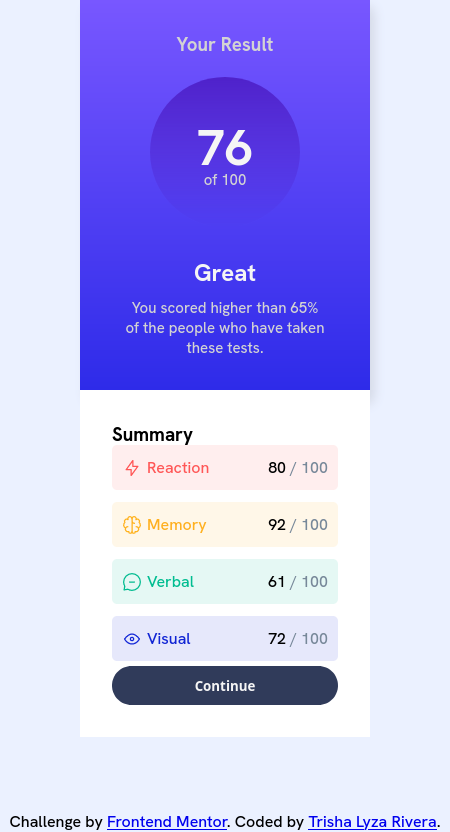
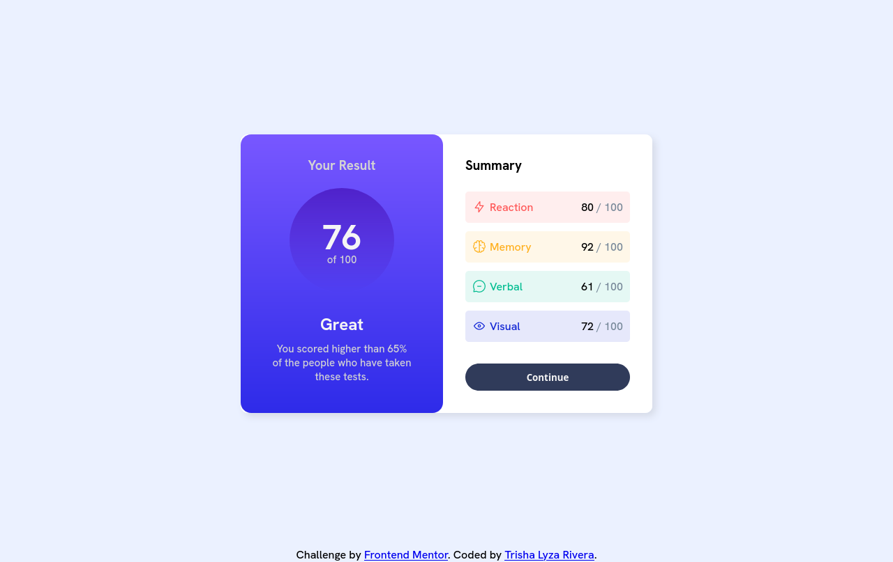

# Frontend Mentor - Results summary component solution

This is a solution to the [Results summary component challenge on Frontend Mentor](https://www.frontendmentor.io/challenges/results-summary-component-CE_K6s0maV). Frontend Mentor challenges help you improve your coding skills by building realistic projects. 

## Table of contents

- [Overview](#overview)
  - [The challenge](#the-challenge)
  - [Screenshot](#screenshot)
  - [Links](#links)
  - [Built with](#built-with)
  - [What I learned](#what-i-learned)
  - [Continued development](#continued-development)
  - [Useful resources](#useful-resources)
- [Author](#author)

## Overview

### The challenge

Users should be able to:

- View the optimal layout for the interface depending on their device's screen size
- See hover and focus states for all interactive elements on the page
- **Bonus**: Use the local JSON data to dynamically populate the content

### Screenshot

### Links

- Solution URL: [My Solution URL](https://www.frontendmentor.io/solutions/responsive-result-summary-component-with-html-and-css-cIoJ4KwORx)
- Live Site URL: [My Live URL](https://alixiadae.github.io/results-summary-component-main/)

## My process

### Built with

- Semantic HTML5 markup
- CSS custom properties
- Flexbox

### What I learned

Using media-query to make my design mobile-friendly

### Continued development

Learn more about media-query and how to make "mobile first" designs for my pages

### Useful resources

- [Media Query](https://www.w3schools.com/css/css_rwd_mediaqueries.asp) - Used this as a guide on adding appropriate classes for the mobile design

## Author
- Frontend Mentor - [@AlixiaDae](https://www.frontendmentor.io/profile/AlixiaDae)
- Github - [@AlixiaDae](https://github.com/AlixiaDae)

